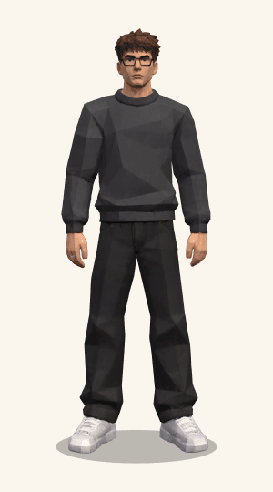

# 👨‍💻 Matheus Dias Portfolio

Try here 👉 [matheusdias.dev](https://matheusdias.dev)</br>
My personal website and portfolio, built with Vue 3 and Vite!!</br>
If you think it's good, can you give me a star 🌟?</br>

<p align="center"></p>

### 🚀 Project Setup & Running

```sh
npm install
npm run dev
```

### TODOs and Ideas

- [x] Add my main projects
- [x] Fix mobile layout to work on any standard smartphone
- [x] Fix headers that are not changing label when tha lang is switched
- [ ] Change darkmode colors
- [x] Standardize styling
- [x] Change Language select to a custom one 
- [x] Add my JSON Searcher extension on projects
- [x] Add animations
- [x] Add Portuguese support
- [x] Add dark mode support
